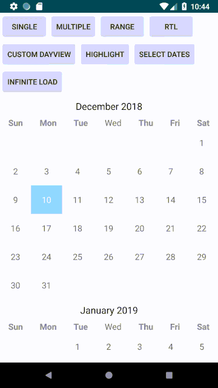
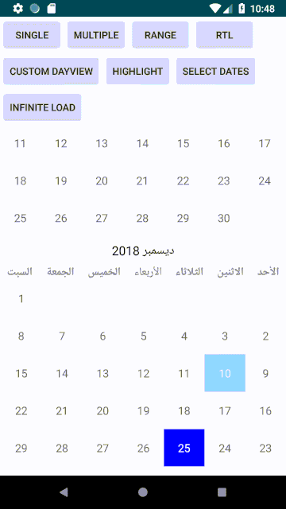
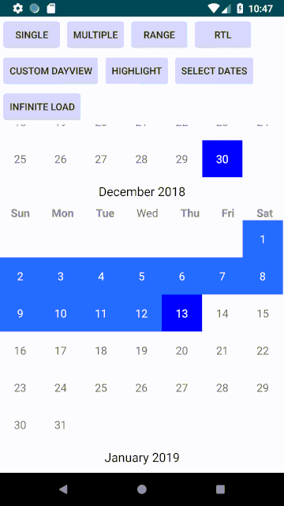
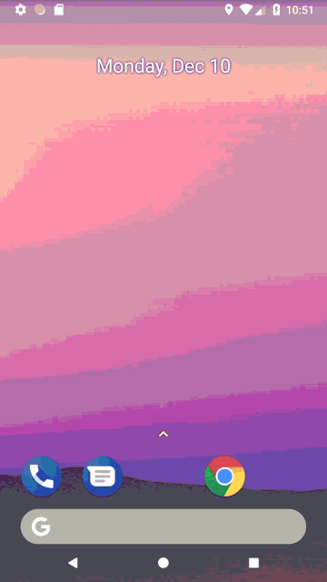
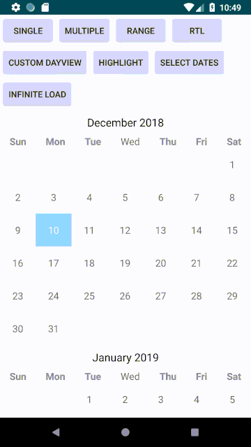
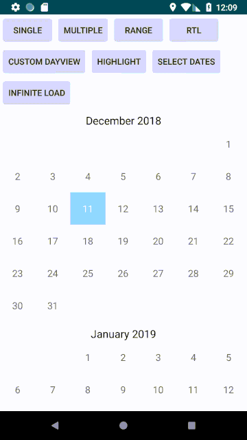
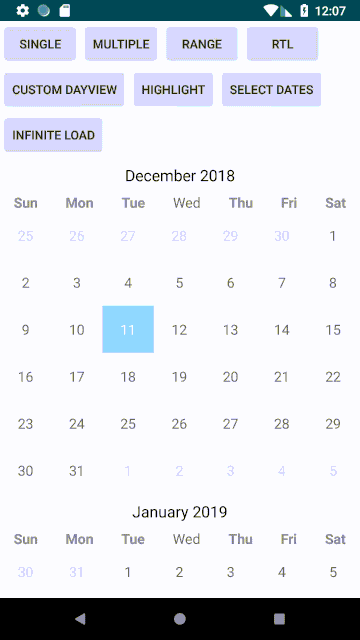

# ShaCalendar

[](https://travis-ci.org/ShahulAndro/sha-calendar-android)


ShaCalendar is new approach of displaying calendar as view or viewgroup in your apps.
It used advanced framework to support and bring your app uptodate with new versions of Android.
Its easy to integrated and more userfriendly.

Its not implemented with any thrid party libraries, its fully implemented on Android apis.
It will save your plenty of time.

ShaCalendar is a lightweight Android library

# Features!
  - load the calendar by month and year
  - Single day selection
  - Multiple day selection
  - Select days with range
  - Enable/disable week days in month
  - Custom day view
  - Highlight, select days
  - Infinite calendar loading
  - Right to left lanugage(RTL) support

You can also:
  - Update the views with your custom view with your own data
  - Choose to display previous month days and next month days in the calendar
  - Can able to set and manage custom scroll listener
  - Library supports show or hide weekdays

### How to

To get a Git project into your gradle build:

Step 1. Add the JitPack repository to your build file
```
allprojects {
	repositories {
		...
		maven { url 'https://jitpack.io' }
	}
}
```
Step 2. Add the dependency
```
dependencies {
	 implementation 'com.github.ShahulAndro:sha-calendar-android:1.0'
}

```

Please check the following for maven build

Step 1. Add the JitPack repository to your build file
```
<repositories>
	<repository>
		<id>jitpack.io</id>
		<url>https://jitpack.io</url>
	</repository>
</repositories>
```
Step 2. Add the dependency
```
<dependency>
	<groupId>com.github.ShahulAndro</groupId>
	<artifactId>sha-calendar-android</artifactId>
	<version>1.0</version>
</dependency>
```

### Examples

```
<com.sha.calendar.lib.view.CalendarPickerRecyclerView
        android:id="@+id/calendar_recyclerview"
        android:layout_width="match_parent"
        android:layout_height="wrap_content"/>
```
Single selection mode is the default selection mode, you can set select modes via Calendar Settings like the following code
```
CalendarPickerRecyclerView calendarPickerRecylerView = findViewById(R.id.calendar_recyclerview);
calendarPickerRecylerView.setLayoutManager(new LinearLayoutManager(this));
calendarPickerRecylerView.initSettings().setSelectionMode(SelectionMode.SINGLE).apply().loadContent();
```

Multiple selection mode with Calendar Settings
```
CalendarPickerRecyclerView calendarPickerRecylerView = findViewById(R.id.calendar_recyclerview);
calendarPickerRecylerView.setLayoutManager(new LinearLayoutManager(this));
calendarPickerRecylerView.initSettings().setSelectionMode(SelectionMode.MULTIPLE).apply().loadContent();
```
Range selection mode with Calendar Settings
```
CalendarPickerRecyclerView calendarPickerRecylerView = findViewById(R.id.calendar_recyclerview);
calendarPickerRecylerView.setLayoutManager(new LinearLayoutManager(this));
calendarPickerRecylerView.initSettings().setSelectionMode(SelectionMode.RANGE).apply().loadContent();
```


you can highlight the day, group of days and clear the highlight days at runtime, library supports the following methods
```
public void highlightDates(Date date)
public void highlightDates(Collection<Date> dates)
public void clearHighlightDates(Collection<Date> dates)
```
for example:
```
calendarPickerRecylerView.highlightDates(ShaCalendarUtils.calendarFor(2018, 12, 31).getTime());
```
you can give any date within the calendar range

you can select the day, range of days at runtime and clear day selection, library supports the following methods
```
public void selectDate(Date date)
public void selectDates(Date from, Date to)
public void selectDates(Calendar from, Calendar to)
public void clearDateSelection(Date date)
```
for example:
```
Calendar from1 = ShaCalendarUtils.calendarFor(2019, 1, 1);
Calendar to1 = ShaCalendarUtils.calendarFor(2019, 1, 15);
calendarPickerRecylerView.selectDates(from1, to1);

Calendar from2 = ShaCalendarUtils.calendarFor(2019, 2, 15);
Calendar to2 = ShaCalendarUtils.calendarFor(2019, 2, 28);
calendarPickerRecylerView.selectDates(from2, to2);
```
you can give any date range within the calendar


RTL Support:
- programatically you can switch the rtl support
- you can load rtl with settings->language->select any rtl support language as device language



you can set your calendar setting for rtl support like the following
```
public CalendarSettings setLocale(Locale locale)
public CalendarSettings setForceDisplayRTL(boolean isForceDisplayRTL)
```
for example:
```
CalendarPickerRecyclerView calendarPickerRecylerView = findViewById(R.id.calendar_recyclerview);
calendarPickerRecylerView.setLayoutManager(new LinearLayoutManager(this));
calendarPickerRecylerView.
                        initSettings().
                        setLocale(new Locale("ar")).
                        setForceDisplayRTL(true).
                        setSelectionMode(SelectionMode.RANGE).
                        apply().
                        loadContent();
```

You can test rtl support with setting in your device lanaguage setting like the following



Infinite Calendar loading:



You can set Calendar settings to infinite load like the following
```
public CalendarSettings setLoadInfinite(boolean loadInfinite)
```
For example:
```
CalendarPickerRecyclerView calendarPickerRecylerView = findViewById(R.id.calendar_recyclerview);
calendarPickerRecylerView.setLayoutManager(new LinearLayoutManager(this));
calendarPickerRecylerView.
                        initSettings().
                        setLoadInfinite(true).
                        apply().
                        loadContent();
```

Library supports show or hide weekdays with the following Calendar Settings

```
public CalendarSettings setDisplayWeekDaysByMonth(boolean canDisplayWeekDays)
```
For example:
```
CalendarPickerRecyclerView calendarPickerRecylerView = findViewById(R.id.calendar_recyclerview);
calendarPickerRecylerView.setLayoutManager(new LinearLayoutManager(this));
calendarPickerRecylerView.
                        initSettings().
                        setDisplayWeekDaysByMonth(true).
                        apply().
                        loadContent();
```

Library supports show or hide next/previous month days within calendar month with the following Calendar Settings

```
public CalendarSettings setDisplayPreviousNextMonthDaysByMonth(boolean canDisplayPreviousNextMonthDays)
```
For example:
```
CalendarPickerRecyclerView calendarPickerRecylerView = findViewById(R.id.calendar_recyclerview);
calendarPickerRecylerView.setLayoutManager(new LinearLayoutManager(this));
calendarPickerRecylerView.
                        initSettings().
                        setDisplayPreviousNextMonthDaysByMonth(false).
                        apply().
                        loadContent();
```

License
-------

    Copyright 2018 Shahul Hameed Shaik

    Licensed under the Apache License, Version 2.0 (the "License");
    you may not use this file except in compliance with the License.
    You may obtain a copy of the License at

       http://www.apache.org/licenses/LICENSE-2.0

    Unless required by applicable law or agreed to in writing, software
    distributed under the License is distributed on an "AS IS" BASIS,
    WITHOUT WARRANTIES OR CONDITIONS OF ANY KIND, either express or implied.
    See the License for the specific language governing permissions and
    limitations under the License.